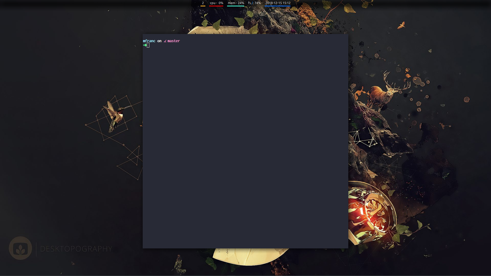

Welcome to my dotfiles.
This is still work in progress.

## First step is to clone this repo

- git init in your home dir
- `git add remote origin git@github.com:michal-franc/dotfiles.git`
- `git fetch --all`

Then follow: [ubuntu/xubuntu/mint installation](/install_instructions/mint). There is only one at the moment. If you are brave enough you can also try [Arch Linux one](/install_instructions/arch).

## Basic Docs

1. [layout system](/layouts)
2. [scripts](/scripts)
3. [visual studio code config](/.config/Code)
4. taskwarrior usage

### What tools do I use

- polybar
- vim
- visual studio code
- ripgrep
- taskwarrior
- rofi
- termite
- mutt
- oh my zsh
- entr
- maim
- htop
- jq
- bat
- tig
- zathura

## Screenshots

