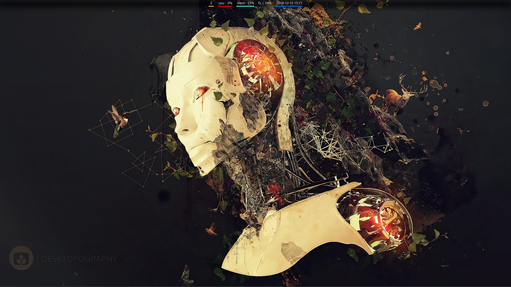

### Common installation step for different Unix/Linux systems

- install - https://github.com/projectivemotion/i3status-taskwarrior
- dont forget to install vim8 with +clipboard and +python3

```
sudo add-apt-repository ppa:jonathonf/vim
sudo apt update
sudo apt install vim
```




